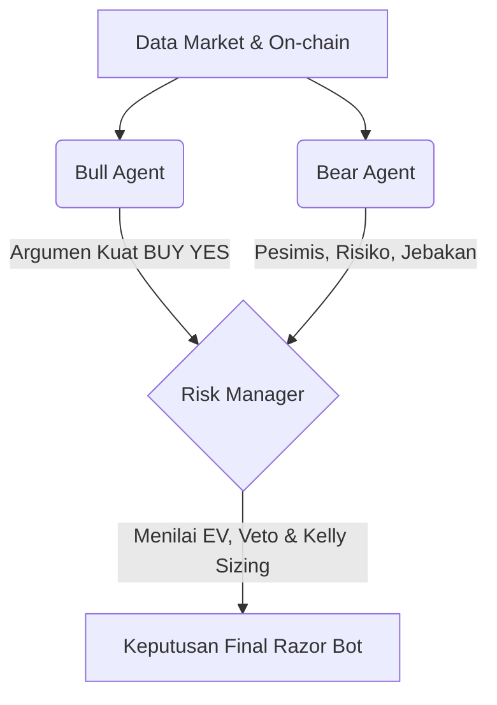

# Arsitektur Multi-Agent & Manajemen Risiko (Level Institusi)

Gue udah nge-rombak total otak AI di Razor Bot. Sekarang, bot lu nggak cuma nganalisa dengan satu AI tunggal, tapi udah pakai arsitektur "Multi-Agent Debate" yang diadaptasi langsung dari bot institusi dengan profit jutaan dolar di Polymarket.

## 1. Pipeline Multi-Agent

Ketika lu ngejalanin perintah `/analyze`, *market* tersebut bakal diuji melalui 3 simulasi agen AI yang berdebat satu sama lain:

### 🐂 The Bull Agent (Agen Banteng)
- **Tugas Utama:** Cari 100% alasan paling kuat kenapa trader HARUS pasang `YES` (Outcome Utama).
- **Fokus Analisis:** Momentum harga, tekanan beli yang tinggi di orderbook (Imbalance), dan berita positif.
- **Output:** Pembelaan mutlak kenapa opsi YES bakal menang.

### 🐻 The Bear Agent (Agen Beruang)
- **Tugas Utama:** Bersikap sinis dan cari 100% alasan kenapa trader HARUS pasang `NO` (Outcome Lawan).
- **Fokus Analisis:** Nyari *trap* (jebakan likuiditas), telatnya update harga Polymarket (latency lag), dan risiko fundamental.
- **Output:** Pembelaan mutlak kenapa opsi NO bakal menang (atau kenapa YES bakal gagal).

### ⚖️ The Risk Manager (Hakim Final)
- **Tugas Utama:** Menengahi debat. Agen ini punya **Hak Veto (VETO POWER)**.
- **Logika Matematis:** Dia menghitung Expected Value (EV). Kalo secara hitungan matematika `EV <= 0` (Nggak ada *edge* / rugi), dia bakal *nge-veto* argumen kedua agen di atas dan langsung ngeluarin keputusan **SKIP**.
- **Output:** Kesimpulan logis, dingin, tanpa emosi, dan gak kemakan FOMA.

---

## 2. Penghitungan Modal Otomatis (Kelly Criterion Sizing)

Buat ngilangin kebiasaan *trading* pakai emosi (kadang *all-in*, kadang masuk terlalu dikit), sang **Risk Manager** sekarang dilengkapi rumus matematika dewa bernama **Kelly Criterion**:

> `f* = ((Edge / 100) * Odds - (1 - (Edge / 100))) / Odds`

Agen ini bakal ngitung selisih antara tebakan dia vs tebakan publik Polymarket. Kalo emang nemu "celah", dia bakal ngeluarin angka **Rekomendasi Persentase Sizing Modal** (contoh: *Kelly Sizing Rec: 2.5%*). Dan tenang aja, sistem udah gue *cap* (batasi) di angka maksimal 5% biar lu gak pernah bangkrut mendadak (Half-Kelly Safety).

---

## 3. Fitur UI Baru di Terminal

Sekarang tiap lu nganalisa pake `/analyze`, di dalam kartu *Summary* terminal bakal muncul indikator *high-level* baru:
- **Est. Fair Prob:** Probabilitas murni dari perhitungan AI Razor Bot.
- **Expected Value (EV):** Nilai untung-rugi matematis (dalam bentuk sen per lembar/share).
- **Kelly Sizing Rec:** Saran alokasi portofolio lu yang harus ditaruh di *trade* ini.

---

**Cara Aktifin Fitur Ini Sekarang:**
Karena perombakan ini merubah struktur kodingan inti di Node.js (`app.js` dan `qwen.js`), lu **WAJIB nge-restart server bot** di Command Prompt/PowerShell lu:
1. Buka terminal tempat lu ngejalanin `npm start`.
2. Tekan `Ctrl + C` buat nge-stop server.
3. Ketik lagi `npm start` lalu tekan Enter.

---

## 4. Pemetaan Arsitektur "Bot $1M Polymarket"
(Berdasarkan riset artikel *28 tools under the hood of bot that made $1M on Polymarket*)

Berikut adalah transparansi total mengenai apa saja elemen dari bot bernilai miliaran rupiah tersebut yang sudah berhasil kita "kloning" dan integrasikan ke Razor Bot, serta apa yang belum:

### LAYER 1 - BRAIN (AI Reasoning)
**Status: ✅ Terintegrasi Penuh**
- **Di Artikel:** Menggunakan Claude, Qwen3-Coder, dan arsitektur *Claude Squad*.
- **Di Razor Bot:** Kita mengimplementasikan *Qwen Squad* secara *native* (`qwen-turbo`, `qwen-plus`, `qwen-max`). Terlebih lagi, sistem pencegahan kebangkrutan (*Risk Management*) via *Native Math JavaScript* yang kita bangun telah menutup kelemahan fatal *LLM Hallucination* (dimana AI sering salah ngitung matematika).

### LAYER 2 - ORCHESTRATION (Making agents do things)
**Status: ✅ Terintegrasi Penuh**
- **Di Artikel:** *Agency Agents* (Debat Bull vs Bear vs Risk Manager veto), *MiroThinker* (Chain-of-thought logic).
- **Di Razor Bot:** Kita mereplika 1:1 sistem `Agency Agents` (Banteng, Beruang, dan Hakim Final). Ditambah dengan paksaan *Chain-of-Thought* di otak Hakim Final (wajib menghitung *Expected Value* dan *Kelly Sizing* sebelum menjatuhkan vonis), serta kekuatan **Hak Veto** mutlak (wajib SKIP jika `EV <= 0`).

### LAYER 3 - DATA & MARKET SIGNALS (The Eyes)
**Status: ⏳ Sebagian Terintegrasi**
- **Di Artikel:** Memanfaatkan delay/lag antara harga Binance vs Polymarket (*latency arbitrage*), OpenBB, Dexter, Crucix.
- **Di Razor Bot:** 
  - **✅ Binance Collector:** Modul `binance.js` narik data *Orderbook Imbalance* dan *Klines* Binance secara *real-time* untuk mendeteksi *lag* harga di Polymarket sebelum pasar sadar.
  - **✅ Polymarket Assistant Tool:** Mengawasi kedalaman buku pesanan (*orderbook bids/asks*) Polymarket secara *live* di `clob.js`.
  - **❌ Belum Terintegrasi:** *Crucix* (pelacak paus/whale on-chain di jaringan Polygon), *OpenBB* (data makroekonomi institusi massal), *Dexter* (membaca file laporan keuangan SEC untuk saham).

### LAYER 4 - MARKET INTELLIGENCE (Notifikasi & Dasbor)
**Status: ⏳ Sebagian Terintegrasi**
- **Di Artikel:** Polyscope (Telegram Alerts instan), polyrec (Terminal dashboard), WHALES tracker.
- **Di Razor Bot:** 
  - **✅ Polyscope clone:** Modul `alerts.js` & `telegram.js` berjalan 24/7 di latar belakang tanpa rasa lelah (*fatigue-free*), memindai *gap* probabilitas dan nge-PING sinyal matang langsung ke Telegram lu.
  - **✅ polyrec clone:** *Web UI dashboard* lokal di `http://127.0.0.1:8787` berfungsi sebagai kokpit visual lu.
  - **❌ Belum Terintegrasi:** Pelacakan dan fitur *Copy-Trade* otomatis dari dompet crypto paus sukses di Polymarket secara langsung.

### LAYER 5 - BACKTEST & SIMULATION (Pembuktian)
**Status: ❌ Belum Terintegrasi**
- **Di Artikel:** *prediction-market-backtesting*, *polybot execution layer* (Kafka, ClickHouse).
- **Di Razor Bot:** Saat ini Razor Bot murni berfokus pada eksekusi *Forward-testing* (analisa probabilitas secara *live* detik ini juga). Kita belum membangun infrastruktur server *backtester* masif untuk menguji strategi ke jutaan data masa lalu secara terisolasi. 

*Catatan: Kelemahan psikologi manusia seperti ukuran masuk yang tidak konsisten (emosional) dan telat eksekusi (menunggu) kini sudah ditangani oleh bot berkat perhitungan rasional rumus Kelly.*
